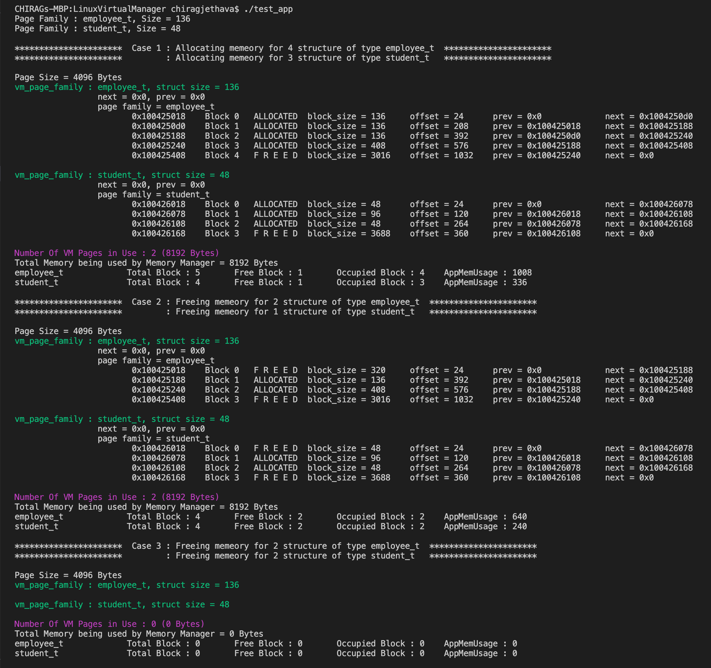

# Linux Memory Manager using C
The main goal of this project is to write custom memory allocator/deallocator in C in order to analyze overall memory usage by application program and also to minimize fragmentation problem faced by standrad C memory allocation/deallocation funtion call.

Instead of sbrk system call this custom memory allocator/deallocator is using mmap call to request one Virtual Page at a time from kernel instead of requesting number of bytes in order to minimize number of request to kernel.


## Sections
- [Linux Memory Manager using C](#linux-memory-manager-using-c)
  - [Sections](#sections)
  - [Building Linux Memory manager dynamic library](#building-linux-memory-manager-dynamic-library)
  - [Building and testing application program](#building-and-testing-application-program)

---
## Building Linux Memory manager dynamic library
```
cd MemoryManager
make
```
Above step will build libmemory.so Linux Memory Manager dynamic library inside MemoryManager dir which you can integrate with your C/C++ application program by including helper_api.h file.


## Building and testing application program
Before going to this stage user have to first build Linux Memory Manager dynamic library(libmemory.so) mentioned in above step.
```
cd LinuxMemorymanager
make
```
This will build test_app executable test program in LinuxMemoryManager dir. This program is build using libmemory.so(Custom Linux Memory Manager) dynamic librray.
After succesfull compilation just run test_app executable program which will dislays all information about memory used by application program as shown in tes_app_result.png Image .
```
./test_app
```


